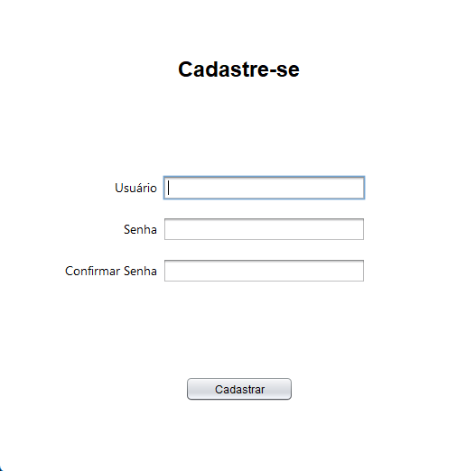
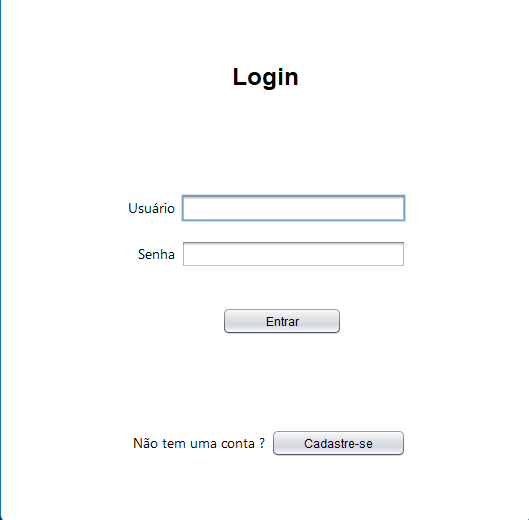
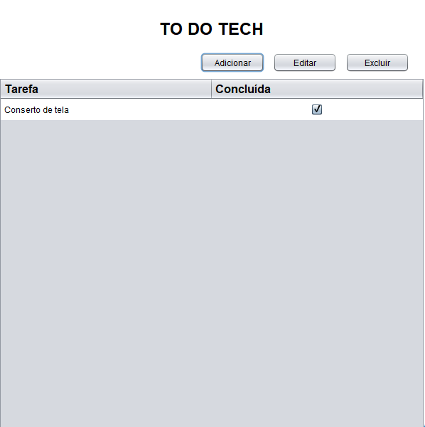
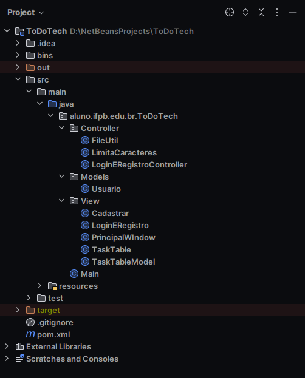

  <h1>TO DO TECH</h1>

<h2>Sobre o To Do Tech</h2>

To Do Tech foi feito com o intuito de auxiliar e organizar as tarefas da minha loja de assistência técnica. Tendo funcionalidades como: 

<ul>
  <li>Cadastro e Login de usuário</li>
  <li>Criar tarefas</li>
  <li>Editar tarefas</li>
  <li>Excluir tarefas</li>
  <li>Checkbox para tarefas concluídas</li>
</ul>

<h3>Modo de uso</h3>
<ol>
  <li>Execute o arquivo jar</li>
  <li>Faça cadastro ou login</li>
  <li>Utilize o sistema</li>
</ol>

<h2>Interfaces</h2>

  

  
Cadastrar

  

  
Login

  

  
Tela Principal

  

  
Estrutura do Projeto

<h2>Licença</h2>

Este projeto está licenciado sob a Licença MIT - veja o arquivo [LICENSE](./LICENSE) para mais detalhes.

